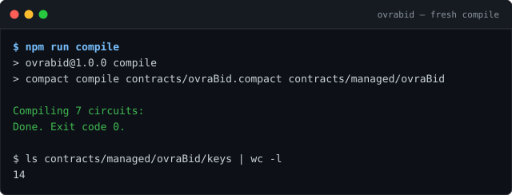
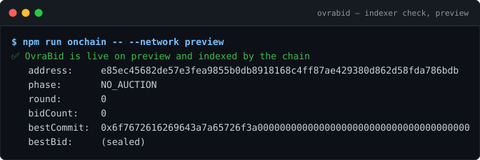
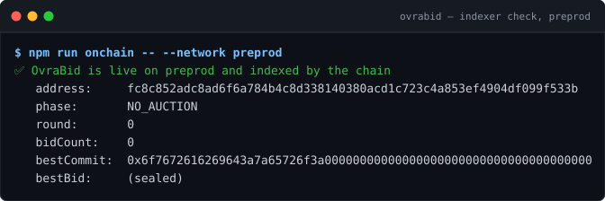
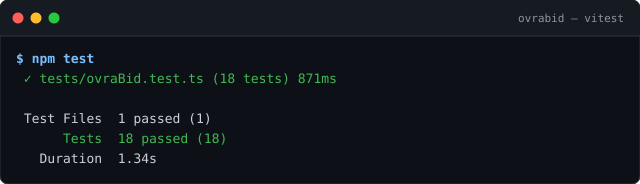

# OvraBid

> A sealed-bid auction on Midnight: private bids, verifiable winner — now with a browser dApp.

## Live Demo

**https://ovrabid.netlify.app** — connect Lace (preprod), seal a secret bid, watch the proof run in your browser.

## Contract Address

| Network  | Address                          |
|----------|----------------------------------|
| Preview  | `e85ec45682de57e3fea9855b0db8918168c4ff87ae429380d862d58fda786bdb` |
| Preprod  | `fc8c852adc8ad6f6a784b4c8d338140380acd1c723c4a853ef4904df099f533b` |

## What This Does

OvraBid implements a **sealed-bid auction** as a Midnight smart contract written in Compact, with a React + Vite browser dApp (Level 2) that connects the Lace wallet and calls the deployed contract.

In a traditional on-chain auction, every bid is public — bidders can wait at the finish line and snipe the highest offer at the last second, and everyone learns your budget. OvraBid fixes this with zero-knowledge proofs:

1. **Commit** — each bidder submits a cryptographic *commitment* (`persistentHash` of their bid amount, a fresh random salt, and their secret key) instead of the bid itself. On-chain, a bid is just an opaque 32-byte digest.
2. **Open** — after the commit window closes, the current best bidder reveals their amount *inside the ZK circuit*: the circuit checks that `H(salt, sk, amount) == bestCommit` holds. A revealed bid can therefore never be forged — the proof only verifies for the person who actually made the commitment.
3. **Claim** — the winner registers themselves (again via a hash equality inside the circuit) and claims the auction. The circuit verifies "I know the secret key whose hash equals `winnerSKHash`" without revealing the key.

The contract supports **multi-round auctions**: after settlement the seller can start the next round, and the `round` counter keeps climbing.

In the browser dApp, **Seal a secret bid** calls the `commitBid` circuit: the amount is generated inside your browser, proven locally against the circuit's prover key, balanced and signed by Lace, and submitted to preprod — the UI itself never displays the amount (it shows `████ (sealed)`).

## Privacy Model

**What is PUBLIC (on-chain, visible to anyone):**
- `phase` — the auction lifecycle: `NO_AUCTION → COMMIT → OPEN → CLAIMED`
- `round` — how many auctions this contract has hosted
- `bidCount` — how many sealed bids have been committed since deployment (cumulative; Compact's `Counter` ledger type is deliberately append-only)
- `sellerCommit` — hash binding the auction to its seller's secret key
- `bestCommit` — the commitment digest of the current best bid
- `bestBid` — the winning amount, only *after* the open phase
- `winnerSKHash` — hash binding the win to the winner's secret key

**What is PRIVATE (private witnesses / circuit arguments, never on-chain):**
- `secretKey` — each participant's 32-byte key, held in the user's private state and handed to circuits via the `localSecretKey` witness
- bid `amount` — a circuit argument of `commitBid` / `openBestBid` / `registerAsWinner`; circuit arguments are private by default in Compact
- `salt` — a fresh random 32-byte value per bid, generated client-side and never revealed to the chain (only fed to the reveal circuits)

**What the user PROVES without revealing:**
- `commitBid` — "I know amount+salt such that `persistentHash([domain, salt, sk, amount])` equals the commitment I just wrote" — enforced by the ZK circuit
- `openBestBid` / `registerAsWinner` — "I know the preimage of `bestCommit`" (the exact amount, salt and key)
- `claimWin` — "I hold the secret key whose domain-separated hash equals `winnerSKHash`"
- seller actions — "I am the seller" via `sellerCommit` hash equality, without revealing the key

## Privacy Claim

An on-chain observer (indexer, block explorer, anyone running a node) sees: the auction's phase and round, the cumulative `bidCount`, three 32-byte commitment digests (`sellerCommit`, `bestCommit`, `winnerSKHash`), and — only after the open phase — the winning `bestBid`. The observer **cannot** see: any individual bid amount before the open phase, the salt any bidder used, anyone's secret key, or which wallet produced which commitment (fresh salts make bids unlinkable). In the dApp this extends to the browser itself: the bid amount never appears in the UI, the network log, or the transaction payload — only inside the ZK proof.

## Tech Stack

- **Midnight Network** (privacy-first blockchain with ZK proofs) — preprod
- **Compact** — Midnight's smart contract language for zero-knowledge circuits
- **Midnight.js SDK 4.1.1** (`midnight-js-contracts`, providers, `dapp-connector-api`)
- **React 18 + Vite 7 + TypeScript** — the browser dApp (`web/`)
- **Lace wallet** (Midnight edition) — key custody, signing, submission
- Node.js v22+, Docker (proof server), Vitest

## Prerequisites

- **Lace wallet** (Midnight edition) browser extension, set to the **preprod** network — required for the dApp
- Node.js ≥ 22 (`node --version`)
- Docker running (`docker info`) — for contract compilation and the local proof server
- The Compact compiler toolchain (installed via the [compact devtools](https://github.com/midnightntwrk/compact/releases)):
  ```bash
  curl -sL https://github.com/midnightntwrk/compact/releases/latest/download/compact-installer.sh | sh
  source "$HOME/.local/bin/env"
  compact update 0.31.1   # 0.31.1 matches compact-runtime 0.16.0 + midnight-js 4.1.1
  compact --version
  ```

## Funding Test Wallets

Deploying to a public testnet requires **tNIGHT** to pay transaction fees (via generated DUST). The deploy script generates a wallet on first use, prints its address, and pauses until funds arrive. The wallet seed and 24-word recovery phrase are stored locally in `.midnight-state.json` (gitignored), so re-running a deploy reuses the same wallet and skips the wait.

| Network  | Faucet                                              | Notes                                              |
|----------|-----------------------------------------------------|----------------------------------------------------|
| Preview  | https://midnight-tmnight-preview.nethermind.dev     | Funded & deployed                                  |
| Preprod  | https://midnight-tmnight-preprod.nethermind.dev     | Funded & deployed                                  |

**How to fund:**

1. Run `npm run deploy -- --network preview` (or `--network preprod`).
2. Copy the **Wallet address** the script prints (it also appears in the `─── Fund Wallet ───` block).
3. Open the faucet URL for that network, paste the address, complete the captcha, and request tNIGHT.
4. The deploy resumes automatically — it polls the balance every 10 s — then registers for DUST and deploys the contract.

Preview deploy wallet address (funded):

```
mn_addr_preview14wcy6mdzsqzssqc3au853x75rnwesgkh6ar74wrknwntefj9gxxsjt6eax
```

Preprod deploy wallet address (funded):

```
mn_addr_preprod1t22sez2kykgcxwc4fxpe4pm3k7tyuvh9696tgl4dzghunmj72p7q7ef4p0
```

Verify the deployed contract's on-chain state via the network indexer (no explorer required — this is the same GraphQL endpoint the DApp SDK reads from):

```bash
curl -s -X POST https://indexer.preprod.midnight.network/api/v4/graphql \
  -H "Content-Type: application/json" \
  -d '{"query":"query Q($address: HexEncoded!) { contractAction(address: $address) { state } }","variables":{"address":"fc8c852adc8ad6f6a784b4c8d338140380acd1c723c4a853ef4904df099f533b"}}'
```

Or run `npm run onchain -- --network preprod` (wraps the same query and pretty-prints the decoded ledger).

## Setup

```bash
git clone https://github.com/KingTaiwoDev/OvraBid.git
cd OvraBid
npm install

# start the proof server (port 6300)
npm run proof-server:start

# compile the contract (creates contracts/managed/ovraBid)
npm run compile
```

Deploy to a public testnet:

```bash
npm run deploy -- --network preview    # or --network preprod
```

The script generates a wallet on first use, prints its address and the faucet URL, and waits for you to fund it at https://midnight-tmnight-preview.nethermind.dev (the seed is preserved in `.midnight-state.json`, gitignored). After funding, the deploy completes and prints the **contract address**.

Interact with the deployed auction:

```bash
npm run cli          # interactive menu: start / commit / open / claim / settle
```

## Run Tests

```bash
npm test
```

18 tests run the compiled ZK circuits entirely in-process (no network, no prover) via a simulator, covering:
- **Circuit logic** — commitment binding, phase guards, authorization asserts
- **State transitions** — the full lifecycle `NO_AUCTION → COMMIT → OPEN → CLAIMED → NO_AUCTION`, multi-round replay, multi-participant bidding
- **Privacy guarantees** — bid amounts, salts and secret keys never appear in any public ledger field; bids with different salts are unlinkable

The browser dApp has its own suite:

```bash
npm run web:test     # 8 tests: error classification, randomness, wiring
npm run web:build    # typecheck + production build
npm run dev          # dev server at http://localhost:5173
```

### Running the dApp locally

```bash
npm install && npm run web:install
npm run compile && npm run sync:web   # refreshes web/public/contract assets
npm run dev
```

Open http://localhost:5173, click **Connect Lace**, and seal a bid. The proof
is generated in your browser via your wallet's proof server; the private
amount never leaves it.

## Initial Idea

Every auction I had seen on a public chain had the same flaw: the bid is the transaction. Anyone watching can read your ceiling from the ledger, wait for the last block, and outbid you by the smallest possible margin. Sealed-bid formats — the kind used for procurement, spectrum licenses, and treasury issuance in traditional finance — were simply impossible when the ledger itself is the room.

Midnight changed that calculus for me. Its data-protection model lets the competitive information in an application (an amount, a choice, an identity) live inside zero-knowledge circuits and private state, while the coordination information — phases, counters, commitments — stays publicly verifiable. That is exactly the split a sealed-bid auction needs: everyone can see that an auction is running and how many bids exist, but nobody can see what anyone bid.

So I built OvraBid. The chain stores only commitment digests (a `persistentHash` of the amount, a fresh salt, and the bidder's secret key); the winning amount is revealed inside a ZK circuit rather than in a transaction; and the winner proves they hold the winning preimage — all without the ledger ever learning a bid before the open phase. The point I wanted this submission to prove is that an application's state machine can be fully public while its valuable state stays sealed — and that every claim here is independently verifiable: compile the contract yourself, run the 18 circuit tests, and query the indexer for both deployed contracts.

## Demo Video

[PLACEHOLDER — I will add the link after recording]

## Screenshots

Fresh compile of the contract (7 circuits, prover/verifier keys generated):



Live on-chain verification via the network indexer — the same GraphQL endpoint the DApp SDK reads:





The in-process circuit test suite (no network, no prover):


