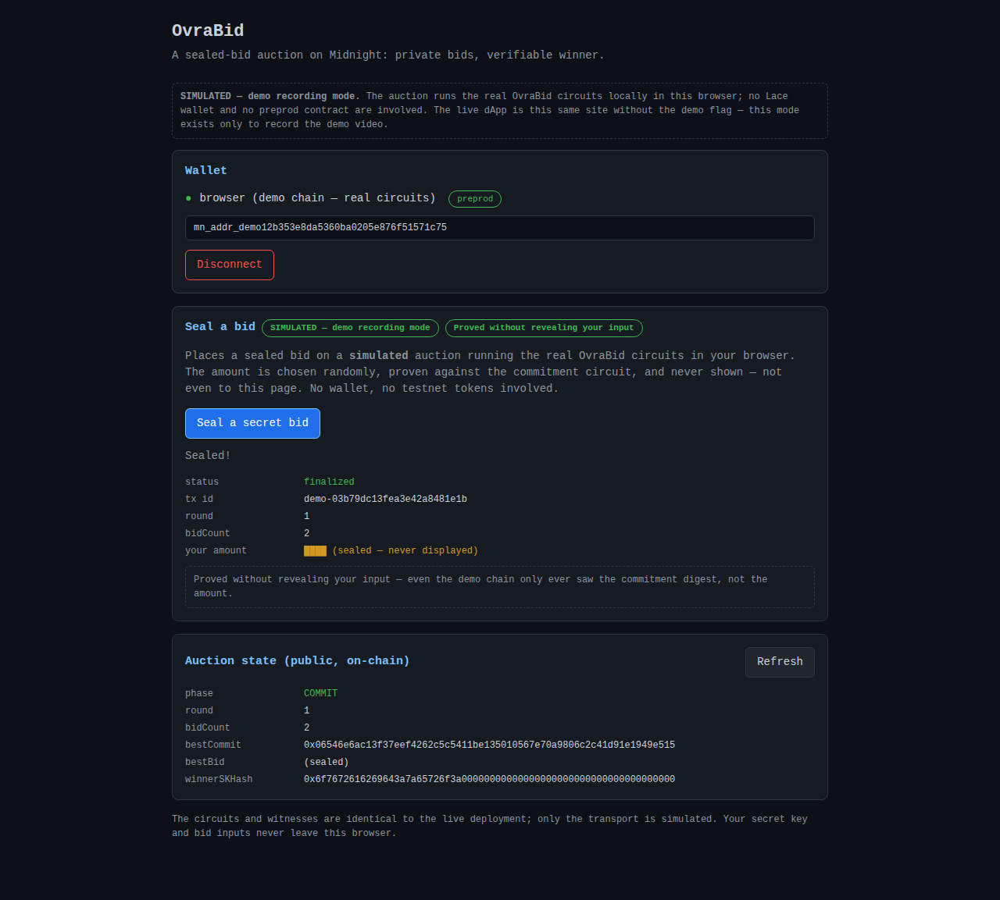

# OvraBid


> A sealed-bid auction on Midnight: private bids, verifiable winner — now with a browser dApp.

## Live Demo

**https://ovrabid.netlify.app** — connect Lace (preprod), seal a secret bid, watch the proof run in your browser.

## Contract Address

| Network  | Address                           |
|----------|-----------------------------------|
| **Preprod**  | `fc8c852adc8ad6f6a784b4c8d338140380acd1c723c4a853ef4904df099f533b` — **the deployment this dApp runs against** |
| Preview  | `e85ec45682de57e3fea9855b0db8918168c4ff87ae429380d862d58fda786bdb` — Level 1 deployment |

The dApp (and every snippet below) targets the **Preprod** address.

## What This Does

OvraBid implements a **sealed-bid auction** as a Midnight smart contract written in Compact, with a React + Vite browser dApp (Level 2) that connects the Lace wallet and calls the deployed contract.

In a traditional on-chain auction, every bid is public — bidders can wait at the finish line and snipe the highest offer at the last second, and everyone learns your budget. OvraBid fixes this with zero-knowledge proofs:

1. **Commit** — each bidder submits a cryptographic *commitment* (`persistentHash` of their bid amount, a fresh random salt, and their secret key) instead of the bid itself. On-chain, a bid is just an opaque 32-byte digest.
2. **Open** — after the commit window closes, the current best bidder reveals their amount *inside the ZK circuit*: the circuit checks that `H(salt, sk, amount) == bestCommit` holds. A revealed bid can therefore never be forged — the proof only verifies for the person who actually made the commitment.
3. **Claim** — the winner registers themselves (again via a hash equality inside the circuit) and claims the auction. The circuit verifies "I know the secret key whose hash equals `winnerSKHash`" without revealing the key.

The contract supports **multi-round auctions**: after settlement the seller can start the next round, and the `round` counter keeps climbing.

In the browser dApp, **Seal a secret bid** calls the `commitBid` circuit: the amount is generated inside your browser, proven locally against the circuit's prover key, balanced and signed by Lace, and submitted to preprod — the UI itself never displays the amount (it shows `████ (sealed)`).

## Privacy Model

- **PUBLIC:** auction `phase`, `round`, `bidCount`, the commitment digests (`sellerCommit`, `bestCommit`, `winnerSKHash`), and the winning `bestBid` after the open phase
- **PRIVATE:** each bid's `amount`, the per-bid random `salt`, and every participant's 32-byte `secretKey`
- **PROVED without revealing:** that each commitment binds a real (amount, salt, key) triple, that a revealed bid matches `bestCommit`, and that the winner/seller holds the key behind `winnerSKHash` / `sellerCommit`

**What is PUBLIC (on-chain, visible to anyone):**
- `phase` — the auction lifecycle: `NO_AUCTION → COMMIT → OPEN → CLAIMED`
- `round` — how many auctions this contract has hosted
- `bidCount` — how many sealed bids have been committed since deployment (cumulative; Compact's `Counter` ledger type is deliberately append-only)
- `sellerCommit` — hash binding the auction to its seller's secret key
- `bestCommit` — the commitment digest of the current best bid
- `bestBid` — the winning amount, only *after* the open phase
- `winnerSKHash` — hash binding the win to the winner's secret key

**What is PRIVATE (private witnesses / circuit arguments, never on-chain):**
- `secretKey` — each participant's 32-byte key, held in the user's private state and handed to circuits via the `localSecretKey` witness
- bid `amount` — a circuit argument of `commitBid` / `openBestBid` / `registerAsWinner`; circuit arguments are private by default in Compact
- `salt` — a fresh random 32-byte value per bid, generated client-side and never revealed to the chain (only fed to the reveal circuits)

**What the user PROVES without revealing:**
- `commitBid` — "I know amount+salt such that `persistentHash([domain, salt, sk, amount])` equals the commitment I just wrote" — enforced by the ZK circuit
- `openBestBid` / `registerAsWinner` — "I know the preimage of `bestCommit`" (the exact amount, salt and key)
- `claimWin` — "I hold the secret key whose domain-separated hash equals `winnerSKHash`"
- seller actions — "I am the seller" via `sellerCommit` hash equality, without revealing the key

## Privacy Claim

An on-chain observer (indexer, block explorer, anyone running a node) sees: the auction's phase and round, the cumulative `bidCount`, three 32-byte commitment digests (`sellerCommit`, `bestCommit`, `winnerSKHash`), and — only after the open phase — the winning `bestBid`. The observer **cannot** see: any individual bid amount before the open phase, the salt any bidder used, anyone's secret key, or which wallet produced which commitment (fresh salts make bids unlinkable). In the dApp this extends to the browser itself: the bid amount never appears in the UI, the network log, or the transaction payload — only inside the ZK proof.

## Tech Stack

- **Midnight Network** (privacy-first blockchain with ZK proofs) — preprod
- **Compact** — Midnight's smart contract language for zero-knowledge circuits
- **Midnight.js SDK 4.1.1** (`midnight-js-contracts`, providers, `dapp-connector-api`)
- **React 18 + Vite 7 + TypeScript** — the browser dApp (`web/`)
- **Lace wallet** (Midnight edition) — key custody, signing, submission
- Node.js v22+, Docker (proof server), Vitest

## Prerequisites

- **Lace wallet** (Midnight edition) browser extension, set to the **preprod** network — required for the dApp
- Node.js ≥ 22 (`node --version`)
- Docker running (`docker info`) — for contract compilation and the local proof server
- The Compact compiler toolchain (installed via the [compact devtools](https://github.com/midnightntwrk/compact/releases)):
  ```bash
  curl -sL https://github.com/midnightntwrk/compact/releases/latest/download/compact-installer.sh | sh
  source "$HOME/.local/bin/env"
  compact update 0.31.1   # 0.31.1 matches compact-runtime 0.16.0 + midnight-js 4.1.1
  compact --version
  ```

## Funding Test Wallets

Deploying to a public testnet requires **tNIGHT** to pay transaction fees (via generated DUST). The deploy script generates a wallet on first use, prints its address, and pauses until funds arrive. The wallet seed and 24-word recovery phrase are stored locally in `.midnight-state.json` (gitignored), so re-running a deploy reuses the same wallet and skips the wait.

| Network  | Faucet                                              | Notes                                              |
|----------|-----------------------------------------------------|----------------------------------------------------|
| Preview  | https://midnight-tmnight-preview.nethermind.dev     | Funded & deployed                                  |
| Preprod  | https://midnight-tmnight-preprod.nethermind.dev     | Funded & deployed                                  |

**How to fund:**

1. Run `npm run deploy -- --network preview` (or `--network preprod`).
2. Copy the **Wallet address** the script prints (it also appears in the `─── Fund Wallet ───` block).
3. Open the faucet URL for that network, paste the address, complete the captcha, and request tNIGHT.
4. The deploy resumes automatically — it polls the balance every 10 s — then registers for DUST and deploys the contract.

Preview deploy wallet address (funded):

```
mn_addr_preview14wcy6mdzsqzssqc3au853x75rnwesgkh6ar74wrknwntefj9gxxsjt6eax
```

Preprod deploy wallet address (funded):

```
mn_addr_preprod1t22sez2kykgcxwc4fxpe4pm3k7tyuvh9696tgl4dzghunmj72p7q7ef4p0
```

Verify the deployed contract's on-chain state via the network indexer (no explorer required — this is the same GraphQL endpoint the DApp SDK reads from):

```bash
curl -s -X POST https://indexer.preprod.midnight.network/api/v4/graphql \
  -H "Content-Type: application/json" \
  -d '{"query":"query Q($address: HexEncoded!) { contractAction(address: $address) { state } }","variables":{"address":"fc8c852adc8ad6f6a784b4c8d338140380acd1c723c4a853ef4904df099f533b"}}'
```

Or run `npm run onchain -- --network preprod` (wraps the same query and pretty-prints the decoded ledger).

## Setup & Run Locally

```bash
git clone https://github.com/KingTaiwoDev/OvraBid.git
cd OvraBid
npm install

# start the proof server (port 6300)
npm run proof-server:start

# compile the contract (creates contracts/managed/ovraBid)
npm run compile
```

Run the browser dApp locally:

```bash
npm run web:install && npm run sync:web   # web deps + fresh contract assets
npm run dev                               # http://localhost:5173
```

Open http://localhost:5173, click **Connect Lace**, and seal a bid. The proof
is generated in your browser via your wallet's proof server; the private
amount never leaves it.

Deploy to a public testnet:

```bash
npm run deploy -- --network preview    # or --network preprod
```

The script generates a wallet on first use, prints its address and the faucet URL, and waits for you to fund it at https://midnight-tmnight-preview.nethermind.dev (the seed is preserved in `.midnight-state.json`, gitignored). After funding, the deploy completes and prints the **contract address**.

Interact with the deployed auction:

```bash
npm run cli          # interactive menu: start / commit / open / claim / settle
```

## Run Tests

```bash
npm test
```

Latest run: **18 passed (18)** — `✓ tests/ovraBid.test.ts (18 tests)`.

The suite (`tests/ovraBid.test.ts`) runs the compiled ZK circuits entirely
in-process via a simulator (no network, no prover) and covers the three
required areas — each its own `describe` block:

| Required area | `describe` block | Tests | Sample assertions |
|---|---|---|---|
| **Circuit logic** | `OvraBid > circuit logic` | 7 | commitments bind to (amount, salt, key); bids rejected outside COMMIT; non-seller can't end phase; forged reveals fail |
| **State transitions** | `OvraBid > state transitions` | 7 | full lifecycle `NO_AUCTION → COMMIT → OPEN → CLAIMED → NO_AUCTION`; multi-round replay; multi-participant interleaving |
| **Privacy** | `OvraBid > privacy guarantees` | 4 | amount/salt never appear in any ledger field; different-salt bids are unlinkable to a key |

<details>
<summary><strong>Full test source</strong> — <code>tests/ovraBid.test.ts</code> (278 lines, verbatim, for reviewer verification)</summary>

```typescript
/**
 * OvraBid — sealed-bid auction contract tests.
 *
 * Runs the compiled ZK circuits in-process via the simulator (no network).
 * Covers:
 *   - circuit logic (commitments, asserts, return values)
 *   - state transitions (the full auction lifecycle)
 *   - privacy guarantees (private inputs never appear on the ledger)
 */
import { describe, it, expect } from 'vitest';
import { setNetworkId } from '@midnight-ntwrk/midnight-js-network-id';
import { OvraBidSimulator } from './ovraBid-simulator.js';
import { randomBytes } from './utils.js';
import { Phase } from '../contracts/managed/ovraBid/contract/index.js';

setNetworkId('undeployed');

const SELLER_SK = randomBytes(32);
const BIDDER1_SK = randomBytes(32);
const BIDDER2_SK = randomBytes(32);

const mkAuction = async () => {
  const seller = await OvraBidSimulator.create(SELLER_SK);
  await seller.startAuction();
  return seller;
};

// ─── Circuit logic ───────────────────────────────────────────────────────────

describe('OvraBid > circuit logic', () => {
  it('generates initial ledger state deterministically', async () => {
    const sim0 = await OvraBidSimulator.create(SELLER_SK);
    const sim1 = await OvraBidSimulator.create(SELLER_SK);
    expect(sim0.getLedger()).toEqual(sim1.getLedger());
  });

  it('initializes the ledger with the constructor state', async () => {
    const sim = await OvraBidSimulator.create(SELLER_SK);
    const l = sim.getLedger();
    expect(l.phase).toEqual(Phase.NO_AUCTION);
    expect(l.round).toEqual(0n);
    expect(l.bidCount).toEqual(0n);
    expect(l.bestBid.is_some).toBe(false);
  });

  it('binds bid commitments to amount, salt and secret key', async () => {
    const sim = await mkAuction();
    const amount = 1000n;
    const salt = randomBytes(32);
    const l = await sim.commitBid(amount, salt);

    const sk = sim.getPrivateState().secretKey;

    // Same inputs replay to the exact same on-ledger digest...
    const replay = await OvraBidSimulator.forkFrom(sim, sk);
    const replayed = await replay.commitBid(amount, salt);
    expect(replayed.bestCommit).toEqual(l.bestCommit);

    // ...while any change to (amount, salt, key) yields a different digest.
    const changed = await OvraBidSimulator.forkFrom(sim, sk);
    const changedLedger = await changed.commitBid(amount, randomBytes(32));
    expect(changedLedger.bestCommit).not.toEqual(l.bestCommit);
  });

  it('rejects bids outside the commit phase', async () => {
    const sim = await OvraBidSimulator.create(SELLER_SK);
    await expect(sim.commitBid(1n, randomBytes(32))).rejects.toThrow(/not accepting sealed bids/);
  });

  it('rejects non-sellers ending the commit phase', async () => {
    const sim = await mkAuction();
    const attacker = await OvraBidSimulator.forkFrom(sim, randomBytes(32));
    await expect(attacker.endCommitPhase()).rejects.toThrow(/only the auction starter/);
  });

  it('rejects opening a bid that does not match the commitment', async () => {
    const sim = await mkAuction();
    const salt = randomBytes(32);
    await sim.commitBid(500n, salt);
    await sim.endCommitPhase();
    // wrong amount + wrong salt for the committed digest
    await expect(sim.openBestBid(999n, randomBytes(32))).rejects.toThrow(/does not match/);
    // right amount but wrong salt still fails
    await expect(sim.openBestBid(500n, randomBytes(32))).rejects.toThrow(/does not match/);
  });

  it('rejects a non-winner claiming the auction', async () => {
    const sim = await mkAuction();
    const salt = randomBytes(32);
    await sim.commitBid(500n, salt);
    await sim.endCommitPhase();
    await sim.openBestBid(500n, salt);
    await sim.registerAsWinner(500n, salt);

    const impostor = await OvraBidSimulator.forkFrom(sim, randomBytes(32));
    await expect(impostor.claimWin()).rejects.toThrow(/not the registered winner/);
  });
});

// ─── State transitions ───────────────────────────────────────────────────────

describe('OvraBid > state transitions', () => {
  it('walks the full auction lifecycle phase by phase', async () => {
    const seller = await OvraBidSimulator.create(SELLER_SK);
    expect(seller.getLedger().phase).toEqual(Phase.NO_AUCTION);

    await seller.startAuction();
    expect(seller.getLedger().phase).toEqual(Phase.COMMIT);

    const salt = randomBytes(32);
    await seller.commitBid(750n, salt);
    expect(seller.getLedger().bidCount).toEqual(1n);

    await seller.endCommitPhase();
    expect(seller.getLedger().phase).toEqual(Phase.OPEN);

    await seller.openBestBid(750n, salt);
    await seller.registerAsWinner(750n, salt);
    expect(seller.getLedger().winnerSKHash).not.toEqual(new Uint8Array(32));

    const claimed = await seller.claimWin();
    expect(claimed.price).toEqual(750n);
    expect(seller.getLedger().phase).toEqual(Phase.CLAIMED);

    await seller.settle();
    expect(seller.getLedger().phase).toEqual(Phase.NO_AUCTION);
  });

  it('returns the exact committed price on claim', async () => {
    const sim = await mkAuction();
    const price = 123_456_789n;
    const salt = randomBytes(32);
    await sim.commitBid(price, salt);
    await sim.endCommitPhase();
    await sim.openBestBid(price, salt);
    await sim.registerAsWinner(price, salt);
    const { price: won } = await sim.claimWin();
    expect(won).toEqual(price);
  });

  it('reveals bestBid only in the open phase', async () => {
    const sim = await mkAuction();
    const salt = randomBytes(32);
    await sim.commitBid(250n, salt);
    expect(sim.getLedger().bestBid.is_some).toBe(false);

    await sim.endCommitPhase();
    await sim.openBestBid(250n, salt);
    expect(sim.getLedger().bestBid).toEqual({ is_some: true, value: 250n });
  });

  it('lets later bids overwrite the best commitment during commit', async () => {
    const sim = await mkAuction();
    await sim.commitBid(100n, randomBytes(32));
    const first = sim.getLedger().bestCommit;
    await sim.commitBid(200n, randomBytes(32));
    const second = sim.getLedger().bestCommit;
    expect(first).not.toEqual(second);
    expect(sim.getLedger().bidCount).toEqual(2n);
  });

  it('prevents starting a new auction while one is live', async () => {
    const sim = await mkAuction();
    await expect(sim.startAuction()).rejects.toThrow(/already in its commit phase/);
    await sim.endCommitPhase();
    await expect(sim.startAuction()).rejects.toThrow(/still in its open phase/);
  });

  it('runs a second auction round after settling the first', async () => {
    const seller = await mkAuction();
    const salt = randomBytes(32);
    await seller.commitBid(10n, salt);
    await seller.endCommitPhase();
    await seller.openBestBid(10n, salt);
    await seller.registerAsWinner(10n, salt);
    const round1WinnerHash = seller.getLedger().winnerSKHash;
    await seller.claimWin();
    await seller.settle();

    await seller.startAuction();
    const l = seller.getLedger();
    expect(l.phase).toEqual(Phase.COMMIT);
    expect(l.round).toEqual(2n);
    // bidCount is cumulative across rounds: Compact's Counter ledger type
    // deliberately has no reset/assignment operation (append-only semantics).
    expect(l.bidCount).toEqual(1n);
    // winner binding was reset when settling round 1
    expect(Buffer.from(l.winnerSKHash).equals(Buffer.from(round1WinnerHash))).toBe(false);
  });

  it('lets multiple bidders bid in the same auction (multi-participant)', async () => {
    const seller = await OvraBidSimulator.create(SELLER_SK);
    await seller.startAuction();

    const bidder1 = await OvraBidSimulator.forkFrom(seller, BIDDER1_SK);
    const bidder2 = await OvraBidSimulator.forkFrom(seller, BIDDER2_SK);

    await bidder1.commitBid(100n, randomBytes(32));
    const afterB1 = bidder1.getLedger();
    await bidder2.commitBid(200n, randomBytes(32));

    // The shared public state advanced for both participants.
    expect(afterB1.bidCount).toEqual(1n);
    expect(bidder2.getLedger().bidCount).toEqual(2n);
    expect(bidder2.getLedger().bestCommit).not.toEqual(afterB1.bestCommit);
  });
});

// ─── Privacy ─────────────────────────────────────────────────────────────────

describe('OvraBid > privacy guarantees', () => {
  it('never exposes the bid amount or salt on the ledger during commit', async () => {
    const sim = await mkAuction();
    const amount = 777_777_777n;
    const salt = randomBytes(32);
    await sim.commitBid(amount, salt);

    const l = sim.getLedger() as Record<string, unknown>;
    const serialized = JSON.stringify(l, (_, v) => (typeof v === 'bigint' ? v.toString() : v));
    expect(serialized).not.toContain('777777777');

    // The ledger type has no slot that could carry the amount pre-reveal.
    expect(l).not.toHaveProperty('amount');
    expect(l).not.toHaveProperty('salt');
    expect((l.bestBid as { is_some: boolean }).is_some).toBe(false);
  });

  it('keeps secret keys out of every public ledger field', async () => {
    const seller = await OvraBidSimulator.create(SELLER_SK);
    await seller.startAuction();
    await seller.commitBid(42n, randomBytes(32));

    const serialized = JSON.stringify(seller.getLedger(), (_, v) =>
      typeof v === 'bigint' ? v.toString() : v,
    );
    const skHex = Buffer.from(SELLER_SK).toString('hex');
    expect(serialized).not.toContain(skHex);
    // None of the public byte arrays equals the raw secret key.
    const byteArrays = [
      seller.getLedger().sellerCommit,
      seller.getLedger().bestCommit,
      seller.getLedger().winnerSKHash,
    ];
    for (const arr of byteArrays) {
      expect(Buffer.from(arr).equals(Buffer.from(SELLER_SK))).toBe(false);
    }
  });

  it('makes each bid unlinkable to the bidder key', async () => {
    const seller = await OvraBidSimulator.create(SELLER_SK);
    await seller.startAuction();
    const bidder = await OvraBidSimulator.forkFrom(seller, BIDDER1_SK);

    const saltA = randomBytes(32);
    const saltB = randomBytes(32);
    await bidder.commitBid(100n, saltA);
    const commitA = bidder.getLedger().bestCommit;
    await bidder.commitBid(100n, saltB);
    const commitB = bidder.getLedger().bestCommit;

    // Same amount, same key — a different salt yields an unrelated commitment,
    // so on-chain observers cannot link bids to a key or to each other.
    expect(commitA).not.toEqual(commitB);
  });

  it('stores only a hash of the winner key, never the key', async () => {
    const sim = await mkAuction();
    const salt = randomBytes(32);
    await sim.commitBid(5n, salt);
    await sim.endCommitPhase();
    await sim.openBestBid(5n, salt);
    await sim.registerAsWinner(5n, salt);

    const winnerHash = sim.getLedger().winnerSKHash;
    expect(winnerHash).toHaveLength(32);
    expect(Buffer.from(winnerHash).equals(Buffer.from(sim.getPrivateState().secretKey))).toBe(false);
  });
});
```

</details>
The browser dApp has its own suite: `npm run web:test` — 8 tests (error
classification, randomness, wiring constants), plus a headless-Chromium
smoke test in CI that executes the real circuits in-page against the built
dApp.

The browser dApp has its own suite:

```bash
npm run web:test     # 8 tests: error classification, randomness, wiring
npm run web:build    # typecheck + production build
npm run dev          # dev server at http://localhost:5173
```

## CI/CD

Every push to `main` and every pull request runs the GitHub Actions pipeline
(`.github/workflows/ci.yml`):

1. Checkout and Node.js v22 setup
2. Install the Compact toolchain (0.31.1) and npm dependencies
3. `compact compile` — builds all 7 circuits with their prover/verifier keys
4. Typecheck and run the 18-test circuit suite (in-process simulator)
5. Sync browser artifacts, then install, typecheck, build and unit-test the dApp (8 tests)
6. Boot the built dApp in headless Chromium and run the browser smoke test — the real circuits execute in-page

The badge at the top of this README reflects the latest run on `main`.

### How the browser loads the contract

The compiled module
(`web/public/contract/ovraBid/contract/index.js`, refreshed by
`npm run sync:web`) is **bundled into the app** by Vite, so the circuits,
midnight-js and `@midnight-ntwrk/compact-runtime` share a single runtime
instance — loading the module separately at runtime would create a second
instance and break `instanceof` checks inside the circuits. Only the zkConfig
assets (prover/verifier keys, ZKIR) are fetched at runtime by
FetchZkConfigProvider from the same static tree. Because the imports are
real npm dependencies of `web/`, the Netlify build (which installs `web/` in
isolation) works with no node_modules shadowing.

### Demo video

The committed `docs/demo/ovrabid-demo.mp4` is a reproducible screen recording
of the full flow (connect → seal → sealed result) generated headlessly by
`node scripts/record-demo.mjs --mp4`. It runs the dApp's **demo mode**
(`?demo=1`): a simulated chain executing the **real compiled circuits** in a
real browser, with no wallet — always labeled "SIMULATED" on screen. The
submission video is recorded against the **live deployment** with Lace; use
the committed recording to verify the circuit flow without installing
anything.

`docs/demo/ovrabid-storyboard.mp4` (from
`node scripts/record-storyboard.mjs`) is a screenshot-compilation walkthrough
built only from real captures: the live deployment as it renders, the
contract's **current preprod state queried live from the network indexer**,
and the in-browser circuit run — with caption cards marking the two
Lace-only moments (approval popup, signed transaction) that come from the
owner's own screen recording.

## Initial Idea

Every auction I had seen on a public chain had the same flaw: the bid is the transaction. Anyone watching can read your ceiling from the ledger, wait for the last block, and outbid you by the smallest possible margin. Sealed-bid formats — the kind used for procurement, spectrum licenses, and treasury issuance in traditional finance — were simply impossible when the ledger itself is the room.

Midnight changed that calculus for me. Its data-protection model lets the competitive information in an application (an amount, a choice, an identity) live inside zero-knowledge circuits and private state, while the coordination information — phases, counters, commitments — stays publicly verifiable. That is exactly the split a sealed-bid auction needs: everyone can see that an auction is running and how many bids exist, but nobody can see what anyone bid.

So I built OvraBid. The chain stores only commitment digests (a `persistentHash` of the amount, a fresh salt, and the bidder's secret key); the winning amount is revealed inside a ZK circuit rather than in a transaction; and the winner proves they hold the winning preimage — all without the ledger ever learning a bid before the open phase. The point I wanted this submission to prove is that an application's state machine can be fully public while its valuable state stays sealed — and that every claim here is independently verifiable: compile the contract yourself, run the 18 circuit tests, and query the indexer for both deployed contracts.

## Product Proposal

See [PROPOSAL.md](PROPOSAL.md) — it substantively answers all four required
questions:

1. **Product & users** — a sealed-bid auction engine where the bid is a
   secret; buyers in procurement, treasury issuance, NFT sales and M&A
   processes whose price discovery is distorted by transparent ledgers.
2. **Why Midnight** — a sealed-bid auction is self-contradictory on a
   transparent chain (the ledger *is* the room); Midnight is the only model
   where coordination state is public while the competitive secret lives
   only as circuit witnesses, with proofs — not operators — enforcing the
   reveal.
3. **Data model** — an 11-row table splitting every data point into public
   ledger / private witness / ZK-proved (mirrors the Privacy Model above).
4. **Mainnet feasibility** — realistic by Level 6: the contract, browser
   proving and indexer reads carry over unchanged; remaining work is
   operational (funding, Lace mainnet profile, cost tuning, audit).

## Demo Video

**Level 3 one-minute demo:** ▶ [ovrabid-level3.mp4](docs/demo/ovrabid-level3.mp4) — full dApp flow (real circuits in-browser), `npm test` with 18 passing, and the green CI badge on this README.

**Submission video (Lace on the live dApp):** [PLACEHOLDER — I will add the link after recording]

**Committed recordings — watch now:**

[](docs/demo/ovrabid-demo.mp4)

- ▶ **[Circuit-run recording](docs/demo/ovrabid-demo.mp4)** (16s) — the real compiled OvraBid circuits executing in a browser: connect → proof generation → sealed result (demo mode, labeled SIMULATED; the bid amount is never shown).
- ▶ **[Storyboard walkthrough](docs/demo/ovrabid-storyboard.mp4)** (55s) — the live deployment, the contract's current preprod state queried live from the network indexer, the in-browser circuit run, and caption cards marking the two Lace-only moments of the submission recording.

## Screenshots

Fresh compile of the contract (7 circuits, prover/verifier keys generated):


Live on-chain verification via the network indexer — the same GraphQL endpoint the DApp SDK reads:


The in-process circuit test suite (no network, no prover):


